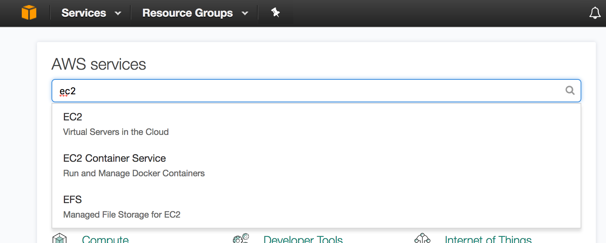
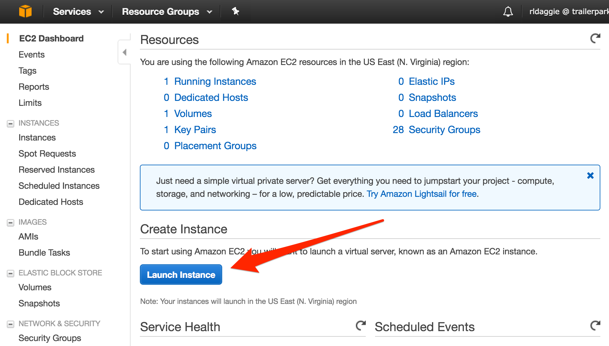
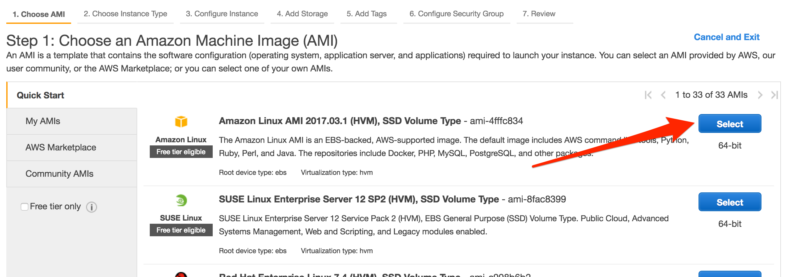
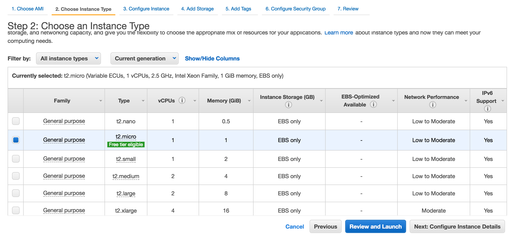
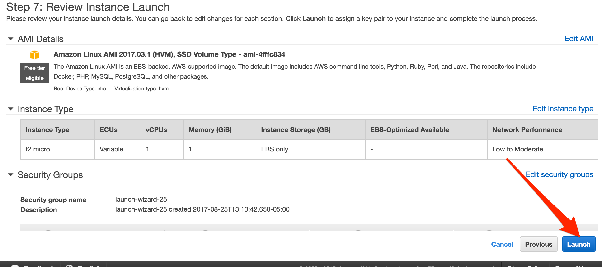
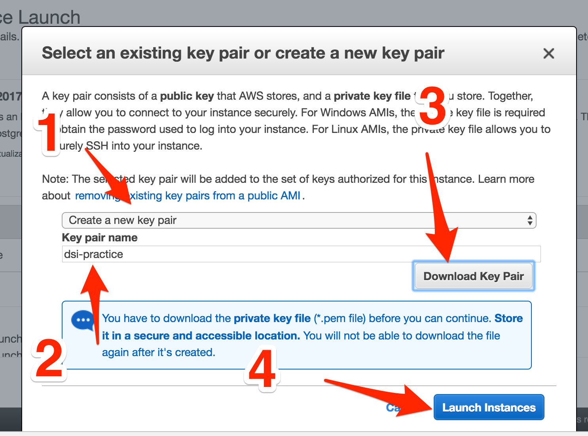
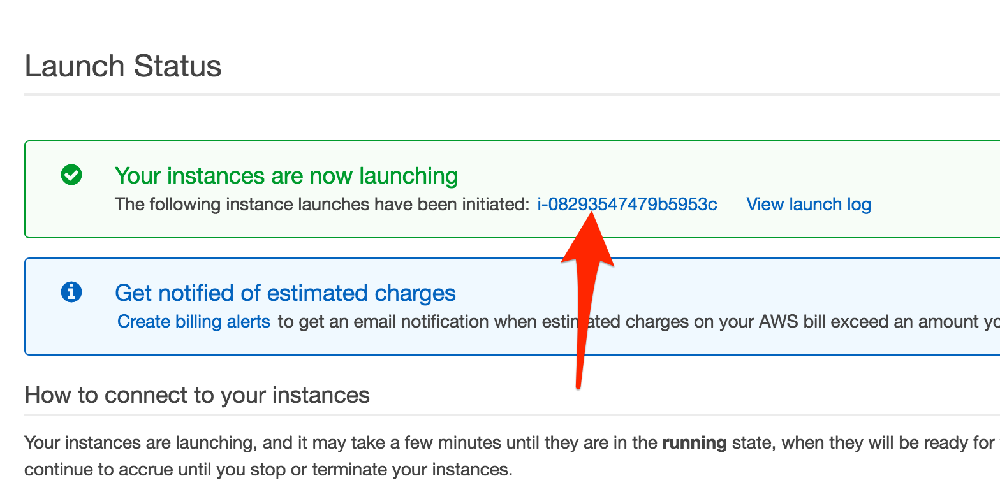
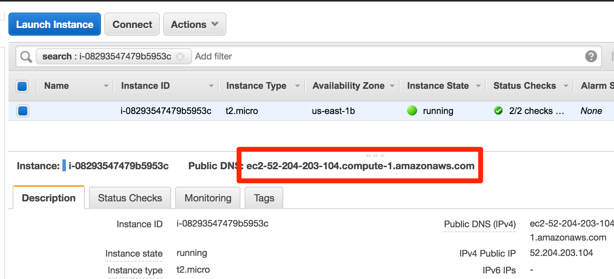

1. From your [AWS Console](https://console.aws.amazon.com/console/home), type `EC2` in the search bar. This will send you to the EC2 dashboard.

2. From the EC2 Dashboard, click "Launch Instance"

3. Choose the default image:

4. Choose instance size, and then click "Review and Launch":
**NOTE**: Be conservative, it's a huge pain to run out of memory.

5. Click "Launch"

6. After that a modal window will prompt you to either create or choose an
   existing `.pem` file. 
  - If you have one you'd like to use, choose that. 
  - If you
need a new one, do the following:
    1. Choose "Create a new key pair"
    2. Ideally give it a lower case name with no spaces.
    3. Click "Download key pair". AWS won't let you click "Launch Instances" until you download your key pair
    4. Using terminal, you'll need to `cd` to the directory that the .pem file is
      in and type the following: `chmod 400 YOUR-PEM-FILE.pem`

7. Click the link similar to the one below to take you to your instance page:

8. Eventually you'll see a green dot next to your instance, letting you know
   it's ready. Take note of of the "Public DNS" line. You'll use that url to
[[SSH|SSH]] into your instance.

